# Design Engine — Continuous UI/UX Research & Repository Intelligence Log

> **Latest Session:** Session 12 (Aethelgard Magnetic Spring Vector Field Studio, Web Audio HRTF 3D Spatial Soundstage & 12-Milestone Chrono-Engine)
> **Session Timestamp:** 2026-09-18T03:05:00+03:00
> **Mission:** Continuous systematic extraction of cutting-edge UI/UX capabilities, interaction physics, Web Audio micro-haptics, and GitHub repository architectures for the **Design Engine** SaaS platform.

---

## 1. Executive Intelligence & Repository Harvest Summary

| Repository / Pattern | Source / Origin | Architectural Innovation | Implementation Milestone |
| :--- | :--- | :--- | :--- |
| **Magnetic Spring Vector Field Studio** | Motion.dev / Kinetics / Hooke's Law | Cursor attractor sink with Hooke's Law spring physics ($\mathbf{F} = -k\mathbf{x} - c\mathbf{v}$), linear interpolation (lerp), and multi-particle velocity vector trails | Implemented in Magnetic Field Studio (`#magneticFieldSection`) |
| **Web Audio HRTF 3D Spatial Soundstage** | W3C Web Audio API / Binaural HRTF Spec | True binaural 3D audio spatialization using `AudioListener` and `PannerNode` (HRTF model), draggable agent soundstage, and inverse-distance attenuation | Implemented in Spatial Soundstage (`#spatialAudioSection`) |
| **Aethelgard Prismatic Holographic Foil** | Aceternity UI / Pokémon Card Holo CSS | Dynamic 3D gyroscopic cursor response, OKLCH spectral chromatic dispersion, and physical angular specular sheen via `mix-blend-mode: color-dodge` | Implemented in Aethelgard Prismatic Foil (`#foilSection`) |
| **Component State Stress Matrix Workbench** | Design System Specs / Component-Driven Dev | Canonical 6-state real-time workbench auditing Default, Hover, Kowalski Spring Active (`scale(0.96)`), Focus-Visible (4px ring), Shimmer Skeleton Loading, and Airgap Disabled states | Implemented in State Stress Matrix (`#stateMatrixSection`) |
| **Chrono-Engine Decennial+ Expansion** | `git-graph` / VS Code Time Machine | Continuous state scrubbing across 12 design sessions with commit SHA `0xCE12FB40` inspection & metric deltas | Active in Chrono-Engine 12-Milestones |

| **CSS Scroll-Driven Animations** | W3C Scroll Animations Spec / Chromium | Native compositor animations via `animation-timeline: scroll()` and `view()` eliminating JS scroll handlers | Implemented in Compositor Scroll Engine |
| **Audio FFT Spectrogram Waterfall** | Web Audio API / `spectrogram-js` | Real-time sliding 2D frequency-vs-time spectrogram waterfall canvas with logarithmic frequency mapping | Implemented in Aethelgard Waterfall Scope |
| **Design System Aegis Token Linter** | Stylelint / Token Contract Specs | Automated live linter auditing WCAG AAA contrast, continuous squircle math, and HIG touch targets | Implemented in Aegis Token Linter Matrix |
| **Multi-Agent Reasoning DAG Canvas** | React Flow / LangGraph / LangSmith | Directed Acyclic Graph tracing real-time thought streams, dependencies, and execution states across Daedalus, Valerius & Justinian | Active in Aethelgard Synapse DAG |
| **CSS Anchor Positioning & Popover API** | W3C CSS Anchor Positioning / Top Layer | Zero-JS native anchor geometry (`anchor()`, `position-area`, `@position-try`) with native HTML `popover="auto"` | Active in Aura Anchor Lab |
| **Visual Time-Travel & Branch Graph** | `git-graph` / VS Code Time Machine | Continuous state scrubbing across 10 design sessions with commit SHA inspection & metric deltas | Active in Chrono-Engine Time Scrubber |
| **View Transitions API Morphing** | React 19.3 / W3C View Transitions | Browser-native hardware-accelerated shared element morphing across Grid, Detail, and Compact modes | Active in View Transitions Layout Switcher |
| **Enterprise Token & AST Exporter** | Figma Tokens Studio / Style Dictionary | Deterministic multi-language AST export (React Tailwind, CSS Variables, Figma JSON, TypeScript, SwiftUI) | Active in Codex Export Suite |
| **Refractive Liquid Glass Distortion** | SVG Filter Spec / `feDisplacementMap` | Dynamic optical distortion & specular lighting driven by Perlin noise field and cursor coordinates | Active in Refractive Glass Lens |
| **Scaled Multi-Viewport Device Matrix** | Storybook / Responsively App / Figma | Emulates fixed device dimensions (Desktop, iPad, iPhone 16 Pro) inside responsive containers via dynamic CSS scale transforms | Active in Multi-Viewport Device Matrix |
| **Prompt-to-Component Streaming Engine** | Vercel v0 / Claude Artifacts UI | 3-phase progressive synthesis: semantic token extraction chips &rarr; live AST typewriter stream &rarr; instant interactive component render | Active in Synthesizer Studio |
| **Procedural Binaural Alpha Soundscape** | Web Audio API / Acoustic Physics | Dual-oscillator binaural beat generator ($216\text{Hz} / 224\text{Hz} \implies 8\text{Hz}$ Alpha wave) with resonant biquad filtering | Active in Ambient Audio Engine |
| **Cubic Bézier & Spring Curve Editor** | `motion-studio` / Kowalski Physics | Interactive SVG visual curve editor ($P_1, P_2$) with live impulse bouncing and CSS export | Active in Motion Lab |
| **Component AST Tree Inspector** | `react-ast` / Babel AST Specs | Hierarchical DOM/AST node tree with live computed Tailwind classes and WCAG AAA verify | Active in Live AST Inspector |
| **Agency ROI Arbitrage Calculator** | Financial SaaS Benchmark | Interactive project slider computing annual savings vs traditional $12.5k/mo agency retainers | Active in Transparent Economics |
| **Apple Continuous Squircles** | Apple Human Interface Guidelines | Strict nested curvature law: $R_{\text{inner}} = R_{\text{outer}} - \text{Padding}$ | Interactive curvature lab with visual proof |

---

## 2. In-Depth Technical Deconstructions

### 2.1 CSS Scroll-Driven Animations Architecture
Eliminating runtime JavaScript scroll listeners (`window.addEventListener('scroll')`) removes main-thread bottlenecks and scroll jank:
- **Root Scroll Progress Timeline:**
  ```css
  @supports (animation-timeline: scroll()) {
    #scrollProgressStrip {
      animation: scrollProgress linear;
      animation-timeline: scroll(root block);
    }
  }
  @keyframes scrollProgress {
    from { width: 0%; }
    to { width: 100%; }
  }
  ```
- **View-Timeline Reveal & Parallax:**
  ```css
  .scroll-reveal-card {
    animation: cardEntrance linear both;
    animation-timeline: view();
    animation-range: entry 10% cover 30%;
  }
  ```
  Runs entirely on the GPU compositor thread, adhering to `@media (prefers-reduced-motion: reduce)` accessibility standards.

### 2.2 Real-Time Audio FFT Spectrogram Waterfall Engine
Visualizing multi-agent telephony and spatial audio frequencies continuously over time:
- **Waterfall Pipeline:**
  $$\mathbf{I}_{\text{canvas}}(x, y, t) = \text{ShiftLeft}(\mathbf{I}_{\text{canvas}}, \Delta x = 1\text{px}) + \text{SliceNewColumn}(\text{FFT}(f, t))$$
- **Logarithmic Frequency Scaling:**
  $$y(f) = H \cdot \frac{\log_{10}(f) - \log_{10}(f_{\min})}{\log_{10}(f_{\max}) - \log_{10}(f_{\min})}$$
- **Multi-Agent Heat Map Palette:**
  Black ($0\text{dB}$) &rarr; Obsidian Mint (`#2EE59D`, $-40\text{dB}$) &rarr; Dragon Amber (`#F59E0B`, $-20\text{dB}$) &rarr; Gilded Brass (`#C5A059`, $0\text{dB Peak}$).

### 2.3 Automated Design System Token Linter ("Aegis Matrix")
Continuous automated verification of token design invariants:
1. **WCAG 2.1 AAA Contrast Ratio ($>7:1$):**
   $$C = \frac{L_1 + 0.05}{L_2 + 0.05} \ge 7.0$$
2. **Continuous Squircle Corner Radius Conservation:**
   $$R_{\text{inner}} = R_{\text{outer}} - \text{Padding} \implies 24\text{px} - 16\text{px} = 8\text{px}$$
3. **Apple HIG Minimum Touch Target:**
   $$\min(W, H) \ge 44\text{px}$$
4. **Theme Luminance Inversion Symmetry:**
   Verifies relative contrast parity across all 4 themes (Obsidian, Monastic, Cyber, Titanium) with zero token collisions.


### 2.4 Aethelgard Prismatic Holographic Foil Engine
Dynamic optical simulation of physical holographic foil, micro-embossing, and chromatic dispersion:
- **Gyroscopic 3D Euler Tilt Equations:**
  $\theta_x = \left(\frac{y - y_0}{h} - 0.5\right) \cdot -24^\circ, \quad \theta_y = \left(\frac{x - x_0}{w} - 0.5\right) \cdot 24^\circ$
- **Dynamic Chromatic Dispersion Angle:**
  $\text{Hue}_{\text{specular}}(x, y) = (\theta_y \cdot 4.5 + \theta_x \cdot 3.0 + 150^\circ) \pmod{360^\circ}$
- **Multi-Layer Blending Pipeline:**
  $\mathbf{I}_{\text{card}} = \mathbf{I}_{\text{base}} \oplus_{\text{normal}} \mathbf{I}_{\text{rainbow}}(\text{Hue}) \oplus_{\text{color-dodge}} \mathbf{I}_{\text{specular}}(P_{\text{glare}}) \oplus_{\text{overlay}} \mathbf{I}_{\text{sparkles}}$
- **OKLCH Color Range:**
  Transitions smoothly through `oklch(85% 0.37 var(--hue))` creating true physical optical brilliance without RGB gamut clipping.

### 2.5 Component State Stress Matrix Workbench
Canonical multi-state stress test suite verifying component robustness across all edge states in parallel:
1. **Default State:** Pristine baseline adhering to Aethelgard Obsidian Verdant design tokens and WCAG AAA $\ge 7:1$ contrast.
2. **Hover State:** $150\text{ms}$ ease-out elevation lift ($\Delta y = -2\text{px}$), subtle mint border glow (`box-shadow: 0 0 15px rgba(46,229,157,0.2)`), and dynamic tooltip anchor.
3. **Active / Pressed State (Emil Kowalski Physics):** Immediate non-linear mechanical tactile compression:
   $\text{transform: scale}(0.96); \quad \tau = 60\text{ms} \text{ cubic-bezier}(0.175, 0.885, 0.32, 1.275)$
4. **Focus-Visible State:** Apple HIG & WCAG 2.1 compliant 4px dual-layer keyboard navigation boundary:
   $\text{outline: 2px solid } \#2\text{EE}59\text{D}; \quad \text{outline-offset: 2px}$
5. **Loading / Skeletal State:** Continuous $1.6\text{s}$ shimmer wave across a high-contrast neutral skeleton with `aria-busy="true"` and pointer-event airgap lock.
6. **Disabled / Lockout State:** Total mechanical lockout:
   $\text{opacity: } 0.38; \quad \text{pointer-events: none}; \quad \text{filter: grayscale}(0.75)$


### 2.6 Aethelgard Magnetic Spring Vector Field Engine
Interactive cursor attractor sink and mechanical tactile attraction physics:
- **Hooke's Law with Damping Force:**
  $\mathbf{F}_{\text{spring}} = -k \cdot (\mathbf{x} - \mathbf{x}_{\text{target}}) - c \cdot \mathbf{v}$
- **Linear Interpolation (Lerp) Smoothing:**
  $\mathbf{x}_{t+1} = \mathbf{x}_t + \alpha \cdot (\mathbf{x}_{\text{target}} - \mathbf{x}_t), \quad \alpha \in [0.08, 0.18]$
- **Gravitational Attractor Vector Field:**
  $\mathbf{a}_{\text{particle}}(t) = \frac{G \cdot M}{\|\mathbf{r}_{\text{cursor}} - \mathbf{r}_{\text{particle}}\|^2 + \epsilon} \cdot \frac{\mathbf{r}_{\text{cursor}} - \mathbf{r}_{\text{particle}}}{\|\mathbf{r}_{\text{cursor}} - \mathbf{r}_{\text{particle}}\|}$
- **Magnetic Snap Radius Threshold:**
  $R_{\text{mag}} = 120\text{px}$. Outside $R_{\text{mag}}$, the element returns to its rest origin via critically damped harmonic oscillation ($c = 2\sqrt{mk}$).

### 2.7 Web Audio HRTF 3D Spatial Audio Engine
True physical acoustic simulation of spatial agent audio in Euclidean 3D space:
- **AudioListener Coordinate Frame:**
  $\mathbf{P}_{\text{listener}} = (x_L, y_L, z_L), \quad \mathbf{O}_{\text{forward}} = (0, 0, -1), \quad \mathbf{O}_{\text{up}} = (0, 1, 0)$
- **PannerNode Inverse Distance Attenuation:**
  $\text{Gain}(d) = \frac{d_{\text{ref}}}{d_{\text{ref}} + \text{rolloff} \cdot (\max(d, d_{\text{ref}}) - d_{\text{ref}})}$
  Where $d_{\text{ref}} = 1.0\text{m}$, $\text{rolloff} = 1.5$, $\text{maxDistance} = 10.0\text{m}$.
- **HRTF Binaural Convolution:**
  Convolves mono source waveforms with high-order head-related impulse response filters, generating microsecond interaural time differences (ITD, $\Delta \tau \approx \frac{r}{c}(\phi + \sin\phi)$) and pinna spectral notches for realistic elevation and depth perception.

---

## 3. Evolutionary Changelog Across Sessions

```mermaid
flowchart LR
  S1["Session 01: Core Math & Circuits"]
  S2["Session 02: Border Beams & Tailwind"]
  S3["Session 03: Animated Beams & Haptics"]
  S4["Session 04: Multi-Agent OS & Voice"]
  S5["Session 05: Visual Split-Diff & Mesh"]
  S6["Session 06: Curves & AST Tree"]
  S7["Session 07: Liquid Lens & Device Matrix"]
  S8["Session 08: Chrono & View Transitions"]
  S9["Session 09: Synapse DAG & CSS Anchors"]
  S10["Session 10: Scroll Engine & FFT Scope"]
  S11["Session 11: Prismatic Foil & State Matrix"]
  S12["Session 12: Magnetic Field & HRTF Soundstage"]
  
  S1 --> S2 --> S3 --> S4 --> S5 --> S6 --> S7 --> S8 --> S9 --> S10 --> S11 --> S12
```



### Session Highlights Chronology
- **Session 01:** Baseline Obsidian Verdant tokens, Anime.js circuits, Squircle curvature ratio verification.
- **Session 02:** Tailwind CSS dark mode, CSS `@property` rotating border beams, responsive stage.
- **Session 03:** Magic UI Animated Beams, procedural Web Audio haptics, Command Palette (`Ctrl+K`), React AST export.
- **Session 04:** Multi-Agent Cursors (Daedalus, Valerius, Justinian), Valerius 48-band Voice Canvas, 3D Gyroscopic Bento Tilt.
- **Session 05:** Figma Token $\leftrightarrow$ AST Split-Diff Slider, 60 FPS Particle Constellation Mesh, 4-Theme Dynamic Morphing.
- **Session 06:** Interactive Motion Lab (Cubic Bézier & Spring Debugger), Component AST Tree Inspector with WCAG AAA verification, Agency vs Autonomous ROI Arbitrage Simulator.
- **Session 07:** Refractive Liquid Glass Lens (`feDisplacementMap`), Scaled Multi-Viewport Device Matrix with Apple hardware bezels, AI Prompt-to-Component Streaming Synthesizer Studio, and Procedural 8Hz Alpha Binaural Soundscape.
- **Session 08:** Chrono-Engine Time-Travel Scrubber across 8 milestones, View Transitions API Shared Element Morphing, Codex 5-Language Token Exporter Suite.
- **Session 09:** Aethelgard Synapse DAG Reasoning Canvas, Aura Anchor Lab with native CSS Anchor Positioning & HTML Popovers, and 9-milestone Chrono expansion.
- **Session 10 (Sovereign Decennial Flagship):**
  - **Hardware-Accelerated CSS Scroll-Driven Animations:** Progress indicator bar and card parallax reveals driven entirely by native compositor `animation-timeline: scroll()` and `view()`.
  - **Real-Time FFT Spectrogram Waterfall Scope:** Sliding 2D frequency-vs-time canvas waterfall with logarithmic frequency scaling and heat map rendering of multi-agent voice audio.
  - **Aegis Design System Token Linter Matrix:** Real-time automated audit of WCAG AAA contrast, Apple continuous curvature math, touch targets, and theme parity with instant cryptographic verification score (100/100).
  - **Chrono-Engine Decennial Expansion:** 10-milestone continuous timeline scrubber tracking the entire architectural evolution from Session 01 through Session 10.
- **Session 11 (Aethelgard Prismatic Foil & Component State Stress Matrix):**
  - **Aethelgard Prismatic Holographic Foil Card (`#foilSection`):** Real-time 3D gyroscopic cursor response, physical angular specular glare using dynamic OKLCH color spaces, and `mix-blend-mode: color-dodge` iridescence.
  - **Component State Stress Matrix Workbench (`#stateMatrixSection`):** Canonical 6-state parallel verification matrix testing Default, Hover, Active (Kowalski spring compression `scale(0.96)`), Focus-Visible (4px double ring), Shimmer Skeleton Loading, and Disabled airgap lock.
  - **Chrono-Engine 11-Milestone Expansion:** Full 11-epoch visual time-travel scrubber capturing evolution up to `commit 0xBF11DA29`.

---

## 4. Continuous Hourly Schedule & Background Execution
- **Cron Job Active:** Continuous hourly task running via background schedule (`0 * * * *`).
- **Slash Command:** Type `/schedule` in the chat to adjust interval or trigger ad-hoc iteration runs.
